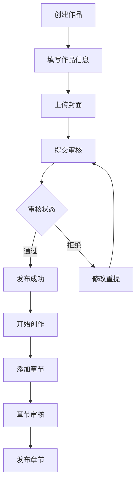
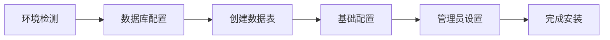
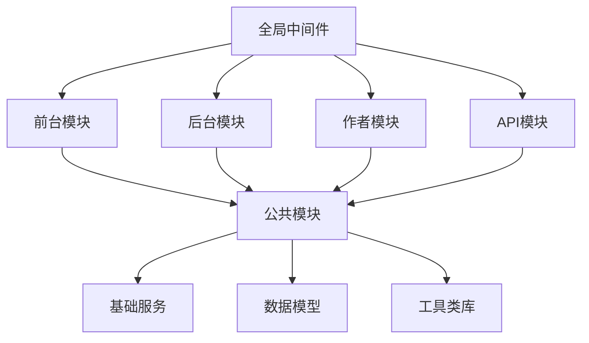

# 🧩 模块结构设计

飞鸟阅读采用多应用模块化架构，将不同功能独立为单独的应用模块，便于开发、维护和扩展。

## 📁 整体模块架构

```
app/
├── home/          # 前台应用 - 用户阅读界面
├── admin/         # 后台应用 - 管理员后台
├── author/        # 作者应用 - 作者创作中心
├── api/           # API应用 - 接口服务
├── install/       # 安装应用 - 系统安装
├── common/        # 公共模块 - 共享组件
└── middleware/    # 全局中间件
```

## 🏠 前台模块 (home)

### 模块职责
- 用户注册、登录、个人中心
- 小说浏览、搜索、分类
- 阅读体验、书架管理
- 评论、收藏、点赞
- VIP充值、支付功能

### 目录结构
```
app/home/
├── controller/              # 控制器层
│   ├── Index.php           # 首页控制器
│   ├── Book.php            # 图书控制器
│   ├── Chapter.php         # 章节控制器
│   ├── User.php            # 用户控制器
│   ├── Search.php          # 搜索控制器
│   ├── Pay.php             # 支付控制器
│   └── ...
├── model/                   # 数据模型层（继承公共模型）
├── middleware/              # 模块中间件
│   ├── Auth.php            # 用户认证中间件
│   └── Install.php         # 安装检测中间件
├── route/                   # 路由定义
│   └── app.php
├── view/                    # 视图层（由模板系统处理）
├── BaseController.php       # 基础控制器
├── common.php              # 公共函数
├── event.php               # 事件定义
└── middleware.php          # 中间件配置
```

### 核心控制器

#### 1. 首页控制器 (Index.php)
```php
class Index extends BaseController
{
    public function index()
    {
        // 获取推荐图书
        $recommend = $this->getRecommendBooks();
        
        // 获取分类图书
        $categories = $this->getCategoryBooks();
        
        // 获取排行榜
        $rankings = $this->getRankings();
        
        return $this->assign([
            'recommend' => $recommend,
            'categories' => $categories,
            'rankings' => $rankings,
        ])->fetch();
    }
}
```

#### 2. 图书控制器 (Book.php)
```php
class Book extends BaseController
{
    public function detail($id)
    {
        // 获取图书详情
        $book = BookModel::getDetail($id);
        
        // 更新浏览量
        BookModel::updateViewCount($id);
        
        // 获取章节列表
        $chapters = ChapterModel::getList($id);
        
        return $this->assign([
            'book' => $book,
            'chapters' => $chapters,
        ])->fetch();
    }
    
    public function chapter($bookId, $chapterId)
    {
        // 权限检查
        $this->checkChapterAuth($bookId, $chapterId);
        
        // 获取章节内容
        $chapter = ChapterModel::getContent($chapterId);
        
        // 记录阅读历史
        $this->recordReadHistory($bookId, $chapterId);
        
        return $this->assign('chapter', $chapter)->fetch();
    }
}
```

## 🛡️ 后台模块 (admin)

### 模块职责
- 系统配置管理
- 用户权限管理
- 内容审核管理
- 数据统计分析
- 插件管理

### 目录结构
```
app/admin/
├── controller/              # 控制器层
│   ├── Index.php           # 后台首页
│   ├── User.php            # 用户管理
│   ├── Book.php            # 图书管理
│   ├── Chapter.php         # 章节管理
│   ├── System.php          # 系统设置
│   ├── Admin.php           # 管理员管理
│   ├── Role.php            # 角色管理
│   ├── Plugin.php          # 插件管理
│   └── ...
├── model/                   # 数据模型层
│   ├── Admin.php           # 管理员模型
│   ├── AdminLog.php        # 操作日志模型
│   └── ...
├── validate/                # 数据验证器
│   ├── Admin.php           # 管理员验证
│   ├── User.php            # 用户验证
│   └── ...
├── middleware/              # 中间件
│   └── Auth.php            # 权限验证中间件
├── view/                    # 后台视图
├── service/                 # 业务服务层
└── ...
```

### 权限管理系统

#### 权限表结构
```php
// 管理员表
fn_admin - 管理员基本信息
fn_admin_group - 管理员分组
fn_admin_group_access - 管理员分组关联
fn_admin_rule - 权限规则表
```

#### 权限检查中间件
```php
class Auth
{
    public function handle($request, $next)
    {
        // 检查登录状态
        if (!session('admin_id')) {
            return redirect('/admin/login');
        }
        
        // 检查权限
        $rule = $request->controller() . '/' . $request->action();
        if (!$this->checkAuth($rule)) {
            return error('权限不足');
        }
        
        return $next($request);
    }
    
    private function checkAuth($rule)
    {
        $adminId = session('admin_id');
        
        // 超级管理员跳过检查
        if ($adminId == 1) {
            return true;
        }
        
        // 获取用户权限
        $rules = AdminModel::getUserRules($adminId);
        
        return in_array($rule, $rules);
    }
}
```

## ✍️ 作者模块 (author)

### 模块职责
- 作者注册认证
- 作品创建管理
- 章节编辑发布
- 收益统计查看
- 读者互动管理

### 目录结构
```
app/author/
├── controller/              # 控制器层
│   ├── Index.php           # 作者首页
│   ├── Book.php            # 作品管理
│   ├── Chapter.php         # 章节管理
│   ├── Income.php          # 收益管理
│   ├── User.php            # 个人设置
│   ├── Sign.php            # 签约管理
│   └── ...
├── model/                   # 作者相关模型
├── middleware/              # 作者权限中间件
├── validate/                # 数据验证
└── view/                    # 作者中心视图
```

### 作品管理流程



## 🔌 API模块 (api)

### 模块职责
- RESTful API接口
- 移动端数据服务
- 第三方系统集成
- 数据同步服务

### 目录结构
```
app/api/
├── controller/
│   └── v1/                  # API版本管理
│       ├── User.php         # 用户API
│       ├── Book.php         # 图书API
│       ├── Chapter.php      # 章节API
│       ├── Author.php       # 作者API
│       └── ...
├── middleware/              # API中间件
│   ├── Auth.php            # API认证
│   └── CrossOrigin.php     # 跨域处理
├── route/                   # API路由
└── ...
```

### API设计规范

#### 1. 统一响应格式
```php
class BaseController
{
    protected function success($data = [], $msg = 'success')
    {
        return json([
            'code' => 200,
            'msg' => $msg,
            'data' => $data,
            'timestamp' => time()
        ]);
    }
    
    protected function error($msg = 'error', $code = 400)
    {
        return json([
            'code' => $code,
            'msg' => $msg,
            'data' => null,
            'timestamp' => time()
        ]);
    }
}
```

#### 2. RESTful路由规范
```php
// 用户相关API
GET    /api/v1/users        # 用户列表
GET    /api/v1/users/{id}   # 用户详情
POST   /api/v1/users        # 创建用户
PUT    /api/v1/users/{id}   # 更新用户
DELETE /api/v1/users/{id}   # 删除用户

// 图书相关API
GET    /api/v1/books        # 图书列表
GET    /api/v1/books/{id}   # 图书详情
GET    /api/v1/books/{id}/chapters  # 图书章节
```

## 🛠️ 安装模块 (install)

### 模块职责
- 系统环境检测
- 数据库初始化
- 基础配置设置
- 管理员账号创建

### 安装流程



## 🔄 公共模块 (common)

### 模块职责
- 共享数据模型
- 公共业务逻辑
- 工具类函数
- 基础服务组件

### 目录结构
```
app/common/
├── model/                   # 公共数据模型
│   ├── Category.php        # 分类模型
│   ├── Novel.php           # 小说模型
│   ├── Rank.php            # 排行榜模型
│   └── SearchLog.php       # 搜索日志模型
├── service/                 # 业务服务层
│   ├── BookService.php     # 图书服务
│   ├── UserService.php     # 用户服务
│   └── PayService.php      # 支付服务
├── library/                 # 类库
│   ├── Auth.php            # 认证类库
│   ├── Upload.php          # 上传类库
│   └── ...
└── ...
```

### 基础模型设计

```php
abstract class BaseModel extends Model
{
    // 自动时间戳
    protected $autoWriteTimestamp = true;
    
    // 软删除
    use SoftDelete;
    protected $deleteTime = 'delete_time';
    
    // 数据完整性检查
    public function checkData($data)
    {
        // 实现数据验证逻辑
    }
    
    // 缓存处理
    public function getCacheData($key, $callback)
    {
        // 实现缓存逻辑
    }
}
```

## 🌐 全局中间件

### 中间件分类

#### 1. 系统中间件
```php
// 语言检测中间件
class CheckLang
{
    public function handle($request, $next)
    {
        // 检测用户语言偏好
        $lang = $this->detectLanguage($request);
        app()->lang->setLangSet($lang);
        
        return $next($request);
    }
}
```

#### 2. 安全中间件
```php
// CSRF防护中间件
class CheckCsrf
{
    public function handle($request, $next)
    {
        if ($request->isPost()) {
            // 验证CSRF Token
            if (!$this->verifyToken($request)) {
                return error('CSRF验证失败');
            }
        }
        
        return $next($request);
    }
}
```

## 🔗 模块间通信

### 事件驱动通信

```php
// 事件定义
class BookPublished
{
    public $book;
    
    public function __construct($book)
    {
        $this->book = $book;
    }
}

// 事件监听器
class BookPublishedListener
{
    public function handle(BookPublished $event)
    {
        // 发送通知
        NotificationService::sendToFollowers($event->book);
        
        // 更新统计
        StatisticsService::updateBookCount();
    }
}

// 触发事件
Event::trigger('BookPublished', $book);
```

### 服务容器

```php
// 服务注册
bind('book.service', function() {
    return new BookService();
});

// 服务调用
$bookService = app('book.service');
$books = $bookService->getRecommendBooks();
```

## 📊 模块依赖关系



## 🎯 模块设计原则

### 1. 单一职责原则
- 每个模块只负责特定的业务领域
- 避免模块功能过于复杂
- 保持模块边界清晰

### 2. 低耦合高内聚
- 模块间通过接口通信
- 减少模块间的直接依赖
- 公共功能抽取到common模块

### 3. 可扩展性
- 支持新模块的动态添加
- 预留扩展接口
- 插件化架构设计

### 4. 安全性
- 各模块独立的权限控制
- 输入数据统一验证
- 敏感操作审计日志

## 🔧 开发建议

### 1. 模块开发流程
1. 分析业务需求
2. 设计模块结构
3. 定义数据模型
4. 实现控制器逻辑
5. 编写视图模板
6. 添加中间件保护
7. 编写单元测试

### 2. 代码规范
- 遵循PSR标准
- 统一命名规范
- 完善注释文档
- 合理的错误处理

### 3. 性能优化
- 合理使用缓存
- 数据库查询优化
- 静态资源压缩
- 代码逻辑优化

::: tip 💡 开发提示
在开发新模块时，建议先查看现有模块的实现方式，保持代码风格的一致性。
:::

## 📚 相关文档

- [🏗️ 系统架构概览](./overview.md)
- [🗄️ 数据库设计](./database.md)
- [🔐 安全机制](./security.md)
- [🛠️ 开发环境搭建](../guide/development/environment.md)
