# 🏗️ 系统架构概览

飞鸟阅读采用现代化的多层架构设计，基于 ThinkPHP6 框架构建，具有模块化、可扩展、高性能的特点。

## 🎯 设计理念

### 核心原则
- **模块化设计**：清晰的功能模块划分，便于维护和扩展
- **职责分离**：前台、后台、API、作者中心各司其职
- **多域名支持**：灵活的域名绑定，支持站群运营
- **插件化扩展**：丰富的插件机制，满足个性化需求

### 技术选型
- **后端框架**：ThinkPHP 6.x - 高性能 PHP 框架
- **数据库**：MySQL 8.0 - 稳定可靠的关系型数据库
- **前端框架**：Layui + BUI - 轻量级前端解决方案
- **缓存系统**：Redis - 高性能内存缓存
- **搜索引擎**：全文索引 - 快速内容检索

## 🏛️ 整体架构

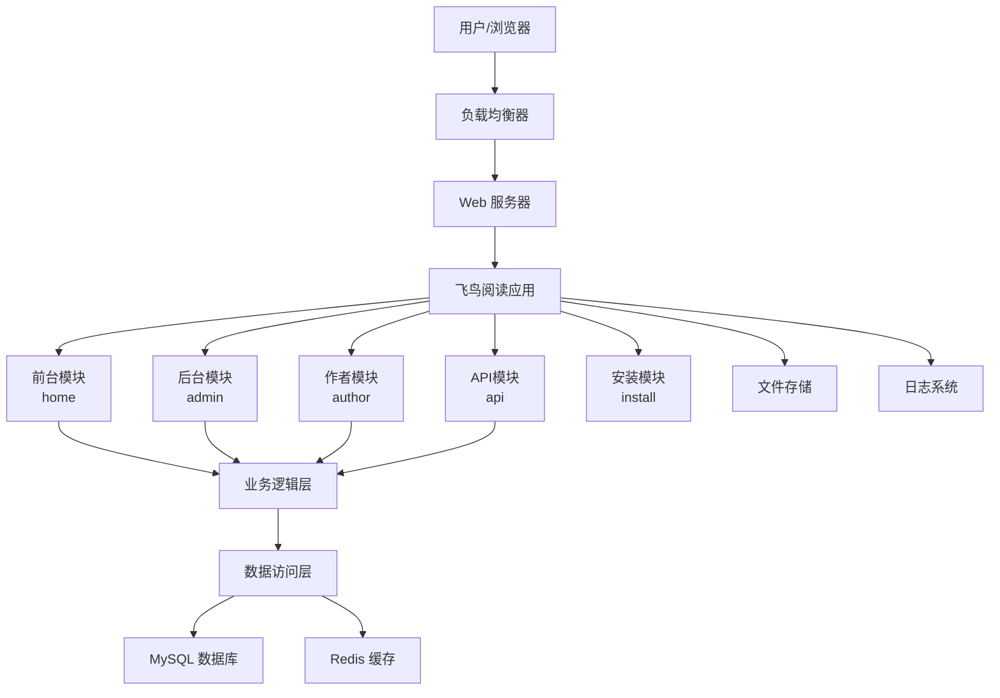

## 📁 目录结构

```
feiniao/
├── app/                    # 应用目录
│   ├── admin/             # 后台管理模块
│   ├── api/               # API接口模块
│   ├── author/            # 作者中心模块
│   ├── home/              # 前台展示模块
│   ├── install/           # 安装模块
│   ├── common/            # 公共模块
│   └── middleware/        # 全局中间件
├── config/                # 配置文件
├── public/                # 入口文件和静态资源
├── runtime/               # 运行时缓存
├── template/              # 模板文件
├── extend/                # 扩展类库
├── vendor/                # Composer依赖
└── addons/                # 插件目录
```

## 🔄 请求生命周期

### 1. 请求接收
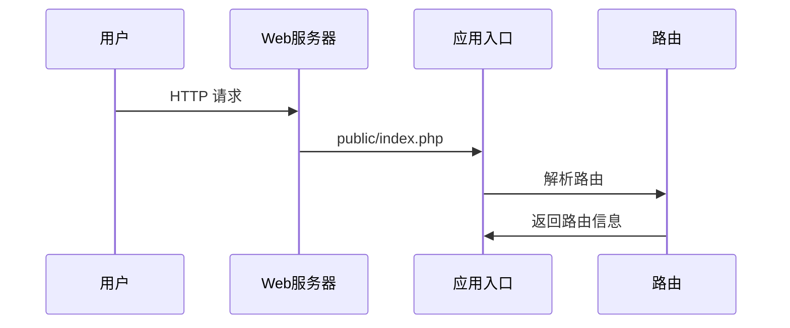

### 2. 应用处理
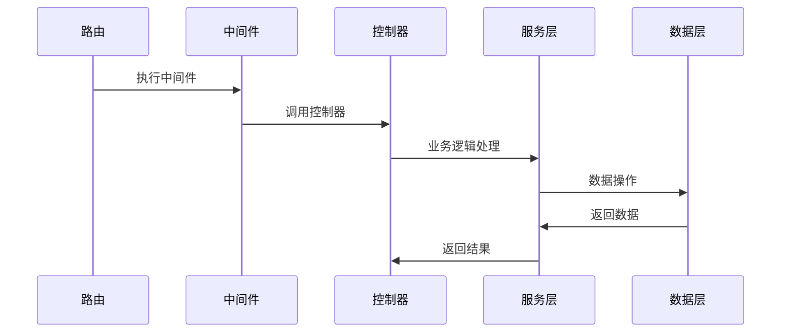

### 3. 响应返回
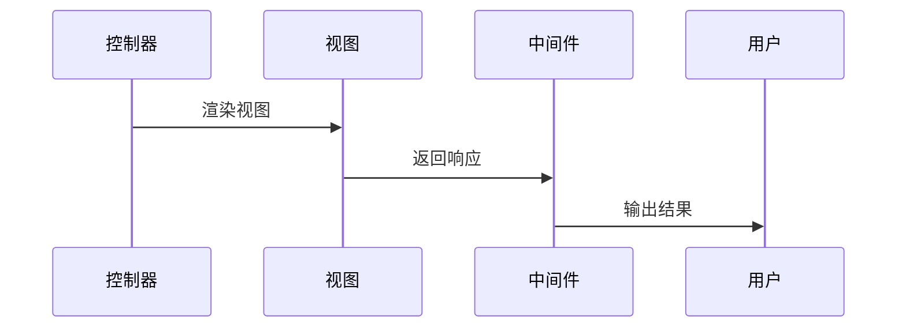

## 🧩 模块架构

### 前台模块 (home)
```
app/home/
├── controller/           # 控制器
│   ├── Index.php        # 首页控制器
│   ├── Book.php         # 图书控制器
│   ├── Chapter.php      # 章节控制器
│   ├── User.php         # 用户控制器
│   └── ...
├── model/               # 数据模型（继承公共模型）
├── view/                # 视图文件（通过模板引擎处理）
├── middleware/          # 模块中间件
└── route/               # 路由定义
```

**主要功能**：
- 小说展示和分类
- 用户注册和登录
- 阅读和收藏功能
- 评论和互动
- 支付和VIP功能

### 后台模块 (admin)
```
app/admin/
├── controller/          # 后台控制器
│   ├── Index.php       # 后台首页
│   ├── User.php        # 用户管理
│   ├── Book.php        # 内容管理
│   ├── System.php      # 系统设置
│   └── ...
├── model/              # 后台数据模型
├── view/               # 后台视图
├── middleware/         # 权限验证中间件
└── validate/           # 数据验证器
```

**主要功能**：
- 内容审核和管理
- 用户和权限管理
- 系统配置
- 数据统计
- 插件管理

### 作者模块 (author)
```
app/author/
├── controller/          # 作者控制器
│   ├── Index.php       # 作者首页
│   ├── Book.php        # 作品管理
│   ├── Chapter.php     # 章节管理
│   ├── Income.php      # 收益统计
│   └── ...
├── model/              # 作者相关模型
├── view/               # 作者中心视图
└── middleware/         # 作者权限中间件
```

**主要功能**：
- 作品创建和管理
- 章节编辑和发布
- 收益统计
- 读者互动
- 合同管理

### API模块 (api)
```
app/api/
├── controller/
│   └── v1/             # API版本管理
│       ├── User.php    # 用户API
│       ├── Book.php    # 图书API
│       └── ...
├── middleware/         # API中间件
│   ├── Auth.php       # 认证中间件
│   └── CrossOrigin.php # 跨域中间件
└── route/             # API路由
```

**主要功能**：
- RESTful API接口
- 移动端支持
- 第三方集成
- 数据同步

## 🗄️ 数据层架构

### 数据模型设计
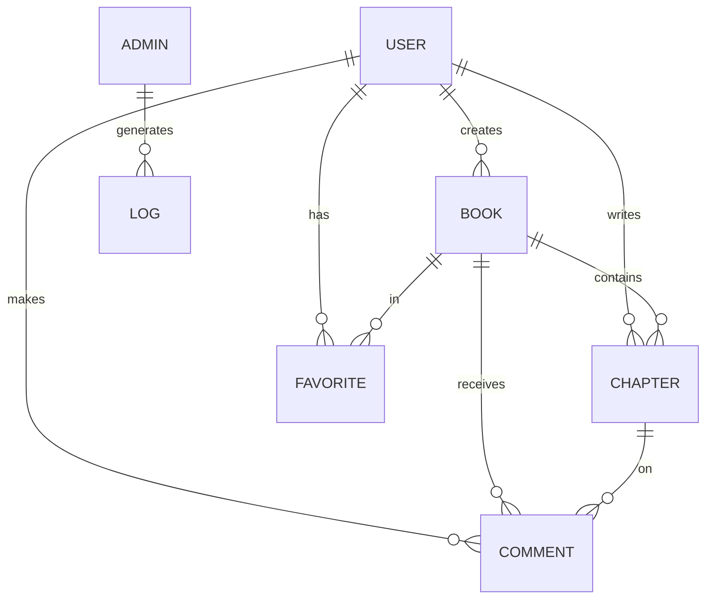

### 缓存策略
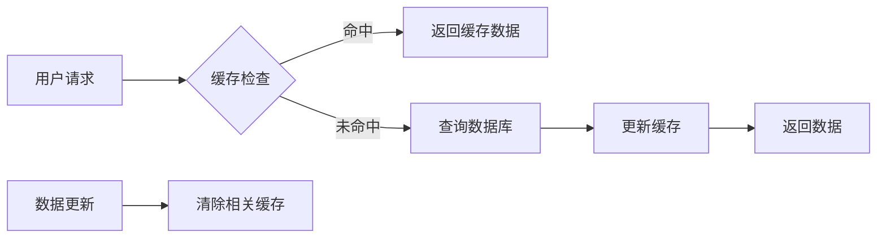

**缓存层次**：
1. **页面缓存**：完整页面的HTML缓存
2. **数据缓存**：数据库查询结果缓存
3. **对象缓存**：业务对象缓存
4. **文件缓存**：静态文件缓存

## 🔐 安全架构

### 安全层次
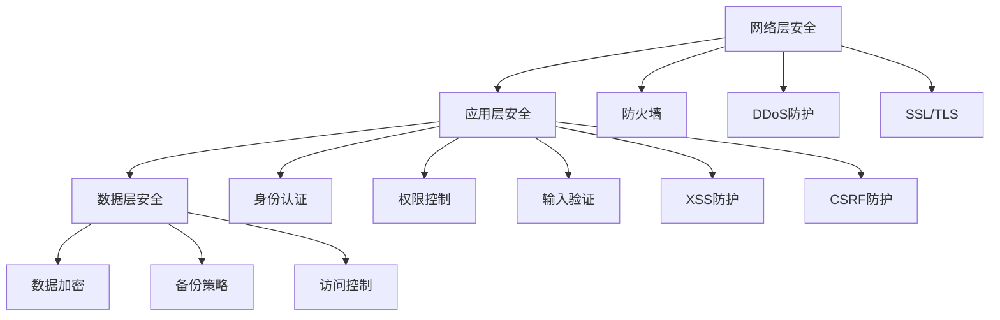

### 认证授权流程
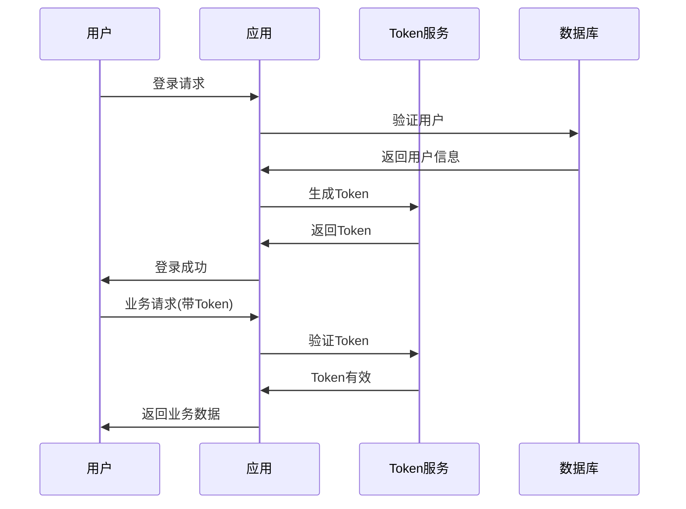

## 🔌 插件架构

### 插件系统设计
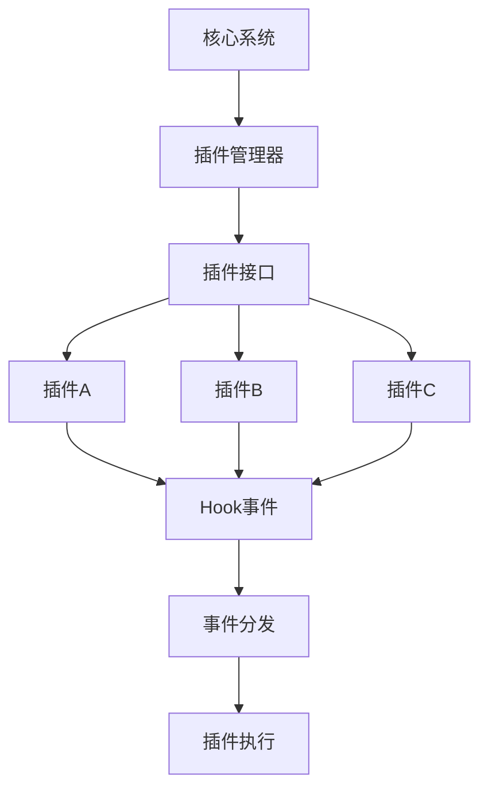

**插件机制**：
- **Hook 系统**：在关键节点提供钩子
- **事件分发**：基于事件的插件触发
- **依赖管理**：插件间依赖关系管理
- **生命周期**：插件的安装、启用、禁用、卸载

## 📊 性能优化

### 优化策略
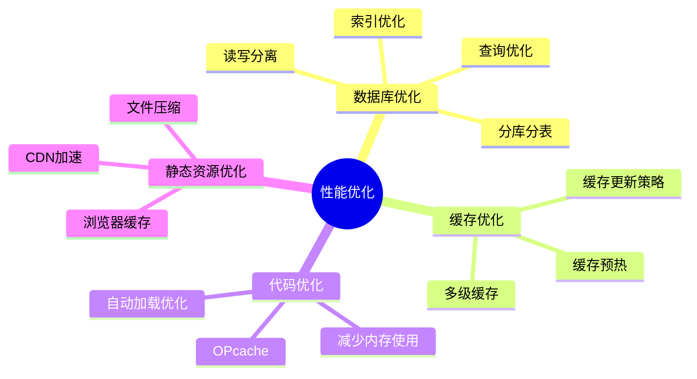

### 监控指标
- **响应时间**：页面加载时间
- **并发能力**：同时在线用户数
- **资源使用**：CPU、内存、磁盘使用率
- **数据库性能**：查询时间、连接数
- **缓存命中率**：缓存效果监控

## 🚀 扩展性设计

### 水平扩展
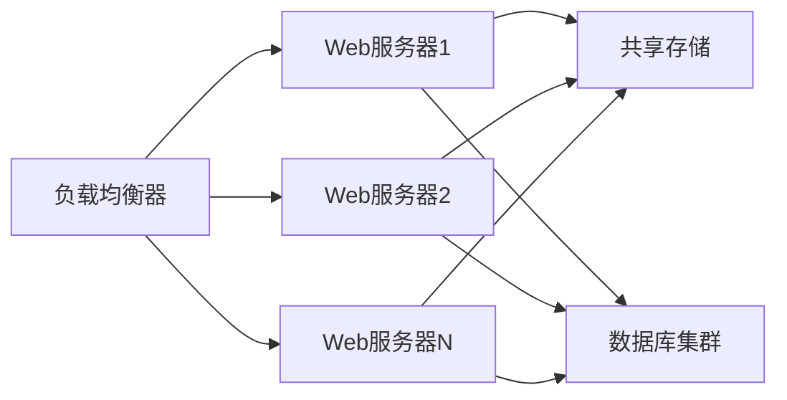

### 垂直扩展
- **服务器升级**：增加CPU、内存、存储
- **数据库优化**：索引优化、查询优化
- **缓存增强**：增加缓存层次和容量

## 🎯 最佳实践

### 开发规范
1. **代码规范**：遵循 PSR 标准
2. **命名规范**：统一的命名约定
3. **注释规范**：完整的代码注释
4. **版本控制**：Git 工作流规范

### 部署规范
1. **环境隔离**：开发、测试、生产环境分离
2. **自动化部署**：CI/CD 流水线
3. **配置管理**：环境配置分离
4. **监控告警**：完善的监控体系

### 运维规范
1. **备份策略**：定期数据备份
2. **日志管理**：日志收集和分析
3. **性能监控**：实时性能监控
4. **安全更新**：及时的安全补丁

## 🔗 相关文档

- [📊 数据库设计](./database.md) - 详细的数据库结构
- [🧩 模块结构](./module-structure.md) - 各模块详细说明
- [🔐 安全机制](./security.md) - 安全设计详解
- [🛠️ 开发环境](../guide/development/environment.md) - 开发环境搭建
- [🔌 插件开发](../guide/development/plugin-development.md) - 插件开发指南
