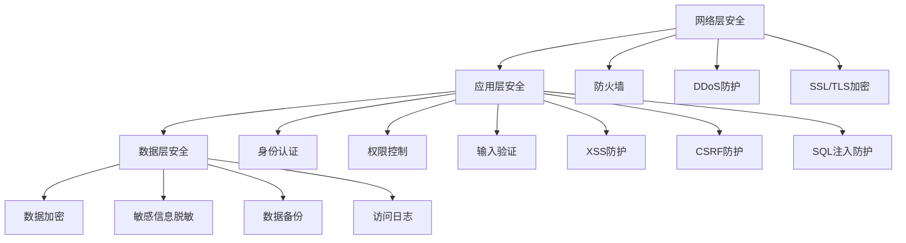
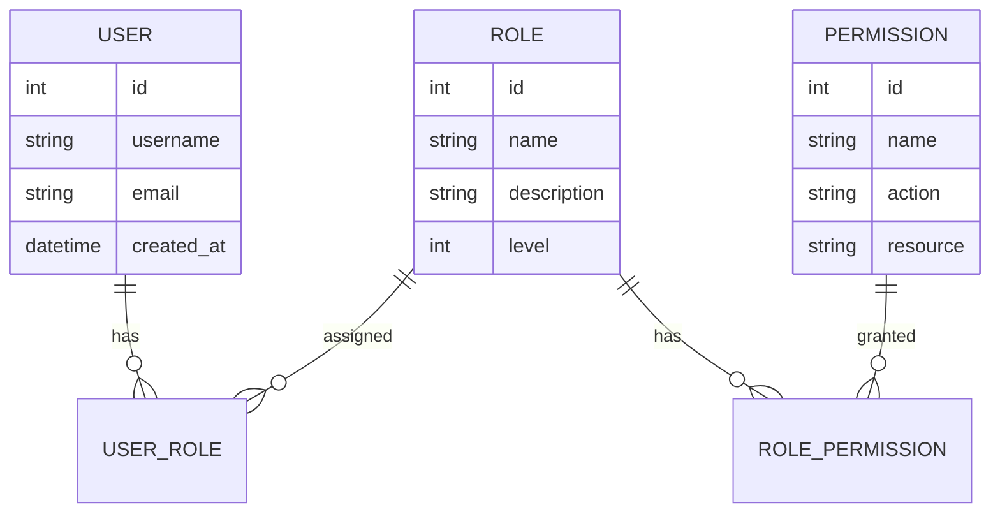
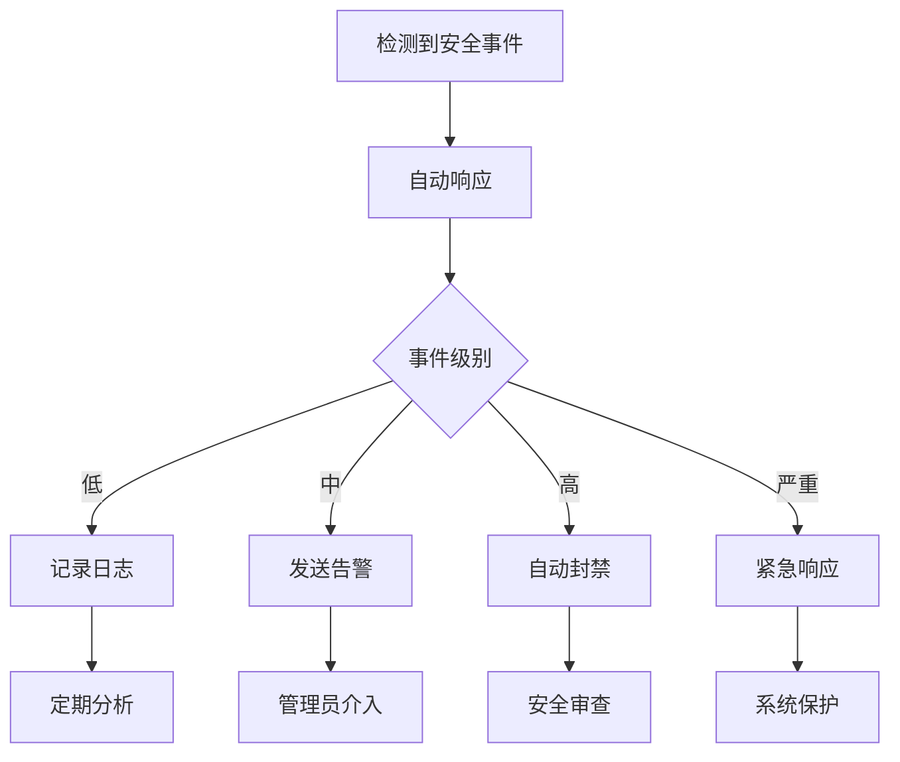

# 🔐 安全机制设计

飞鸟阅读在设计之初就将安全作为重要考量，采用多层次的安全防护机制，确保系统和数据的安全。

## 🛡️ 安全架构概览



## 🔑 身份认证系统

### 用户认证机制

#### 1. 多重认证方式
- **密码认证**: 基础用户名密码登录
- **手机验证**: 短信验证码登录
- **邮箱认证**: 邮箱验证码登录
- **第三方登录**: 微信、QQ等社交登录

#### 2. JWT Token认证
```php
class AuthService
{
    /**
     * 生成JWT Token
     */
    public function generateToken($user)
    {
        $config = config('token');
        $time = time();
        
        $payload = [
            'iss' => $config['issuer'],           // 签发者
            'aud' => $config['audience'],         // 接收者
            'iat' => $time,                       // 签发时间
            'exp' => $time + $config['expire'],   // 过期时间
            'data' => [
                'userid' => $user['id'],
                'username' => $user['username'],
                'role' => $user['role']
            ]
        ];
        
        return JWT::encode($payload, $config['secret'], 'HS256');
    }
    
    /**
     * 验证JWT Token
     */
    public function verifyToken($token)
    {
        try {
            $config = config('token');
            $decoded = JWT::decode($token, new Key($config['secret'], 'HS256'));
            return json_decode(json_encode($decoded), true);
        } catch (Exception $e) {
            throw new AuthException('Token验证失败: ' . $e->getMessage());
        }
    }
}
```

#### 3. 密码安全策略
```php
class PasswordService
{
    /**
     * 密码强度检查
     */
    public function checkStrength($password)
    {
        $rules = [
            'length' => strlen($password) >= 8,                    // 最少8位
            'upper' => preg_match('/[A-Z]/', $password),          // 包含大写字母
            'lower' => preg_match('/[a-z]/', $password),          // 包含小写字母
            'number' => preg_match('/[0-9]/', $password),         // 包含数字
            'special' => preg_match('/[^A-Za-z0-9]/', $password), // 包含特殊字符
        ];
        
        $score = array_sum($rules);
        return $score >= 3; // 至少满足3个条件
    }
    
    /**
     * 密码加密
     */
    public function hashPassword($password)
    {
        return password_hash($password, PASSWORD_ARGON2ID, [
            'memory_cost' => 65536,  // 64MB
            'time_cost' => 4,        // 4次迭代
            'threads' => 3,          // 3个线程
        ]);
    }
    
    /**
     * 密码验证
     */
    public function verifyPassword($password, $hash)
    {
        return password_verify($password, $hash);
    }
}
```

### 会话管理

#### 1. 安全的Session配置
```php
// config/session.php
return [
    'type' => 'redis',                    // 使用Redis存储
    'auto_start' => true,
    'prefix' => 'feiniao_sess_',          // 自定义前缀
    'expire' => 1440,                     // 24小时过期
    'secure' => true,                     // HTTPS环境下启用
    'httponly' => true,                   // 防止XSS
    'samesite' => 'Lax',                  // CSRF防护
    'use_strict_mode' => true,            // 严格模式
    'cookie_lifetime' => 0,               // 浏览器关闭即失效
];
```

#### 2. 会话安全中间件
```php
class SessionSecurity
{
    public function handle($request, $next)
    {
        // 检查会话固定攻击
        if ($this->detectSessionFixation()) {
            session()->regenerate(true);
        }
        
        // 检查会话劫持
        if ($this->detectSessionHijacking($request)) {
            session()->destroy();
            return redirect('/login');
        }
        
        // 更新最后活动时间
        session('last_activity', time());
        
        return $next($request);
    }
    
    private function detectSessionHijacking($request)
    {
        $userAgent = $request->header('User-Agent');
        $ip = $request->ip();
        
        if (session('user_agent') && session('user_agent') !== $userAgent) {
            return true;
        }
        
        if (session('ip_address') && session('ip_address') !== $ip) {
            return true;
        }
        
        return false;
    }
}
```

## 🚪 权限控制系统

### RBAC权限模型



#### 权限检查实现
```php
class PermissionService
{
    /**
     * 检查用户权限
     */
    public function checkPermission($userId, $permission)
    {
        // 获取用户角色
        $roles = $this->getUserRoles($userId);
        
        // 检查角色权限
        foreach ($roles as $role) {
            if ($this->roleHasPermission($role['id'], $permission)) {
                return true;
            }
        }
        
        return false;
    }
    
    /**
     * 权限中间件
     */
    public function middleware($permission)
    {
        return function ($request, $next) use ($permission) {
            $user = auth()->user();
            
            if (!$this->checkPermission($user['id'], $permission)) {
                return error('权限不足', 403);
            }
            
            return $next($request);
        };
    }
}
```

### 细粒度权限控制

#### 1. 资源级权限
```php
class ResourcePermission
{
    /**
     * 检查资源访问权限
     */
    public function canAccess($user, $resource, $action)
    {
        // 检查基础权限
        if (!$this->hasBasicPermission($user, $resource, $action)) {
            return false;
        }
        
        // 检查资源所有权
        if ($this->isOwnershipRequired($resource, $action)) {
            return $this->isOwner($user, $resource);
        }
        
        // 检查特殊条件
        return $this->checkSpecialConditions($user, $resource, $action);
    }
    
    /**
     * 检查是否为资源所有者
     */
    private function isOwner($user, $resource)
    {
        switch ($resource['type']) {
            case 'book':
                return $resource['author_id'] === $user['id'];
            case 'chapter':
                $book = BookModel::find($resource['book_id']);
                return $book['author_id'] === $user['id'];
            default:
                return false;
        }
    }
}
```

## 🛡️ 输入安全防护

### XSS防护

#### 1. 输入过滤
```php
class XssFilter
{
    private $config = [
        'allowed_tags' => '<p><br><strong><em><u><ol><ul><li>',
        'allowed_attributes' => ['href', 'title', 'alt'],
    ];
    
    /**
     * 清理用户输入
     */
    public function clean($input)
    {
        if (is_array($input)) {
            return array_map([$this, 'clean'], $input);
        }
        
        // HTML实体编码
        $input = htmlspecialchars($input, ENT_QUOTES, 'UTF-8');
        
        // 使用HTMLPurifier深度清理
        $purifier = new HTMLPurifier($this->getConfig());
        return $purifier->purify($input);
    }
    
    /**
     * 内容输出时的XSS防护
     */
    public function output($content, $allowHtml = false)
    {
        if ($allowHtml) {
            // 允许安全的HTML标签
            return $this->cleanHtml($content);
        }
        
        return htmlspecialchars($content, ENT_QUOTES, 'UTF-8');
    }
}
```

#### 2. CSP(内容安全策略)
```php
class ContentSecurityPolicy
{
    public function setHeaders()
    {
        $csp = [
            "default-src 'self'",
            "script-src 'self' 'unsafe-inline' *.jquery.com",
            "style-src 'self' 'unsafe-inline' *.googleapis.com",
            "img-src 'self' data: *.qpic.cn *.gtimg.com",
            "font-src 'self' *.googleapis.com *.gstatic.com",
            "connect-src 'self'",
            "frame-ancestors 'none'",
        ];
        
        header('Content-Security-Policy: ' . implode('; ', $csp));
        header('X-Content-Type-Options: nosniff');
        header('X-Frame-Options: DENY');
        header('X-XSS-Protection: 1; mode=block');
    }
}
```

### CSRF防护

#### 1. Token验证
```php
class CsrfProtection
{
    /**
     * 生成CSRF Token
     */
    public function generateToken()
    {
        $token = bin2hex(random_bytes(32));
        session('csrf_token', $token);
        return $token;
    }
    
    /**
     * 验证CSRF Token
     */
    public function verifyToken($token)
    {
        $sessionToken = session('csrf_token');
        
        if (!$sessionToken || !$token) {
            return false;
        }
        
        return hash_equals($sessionToken, $token);
    }
    
    /**
     * CSRF中间件
     */
    public function handle($request, $next)
    {
        if (in_array($request->method(), ['POST', 'PUT', 'DELETE', 'PATCH'])) {
            $token = $request->input('_token') ?: $request->header('X-CSRF-TOKEN');
            
            if (!$this->verifyToken($token)) {
                return error('CSRF验证失败', 419);
            }
        }
        
        return $next($request);
    }
}
```

### SQL注入防护

#### 1. 参数化查询
```php
class SecureDatabase
{
    /**
     * 安全的数据库查询
     */
    public function query($sql, $params = [])
    {
        // 使用预处理语句
        $stmt = $this->pdo->prepare($sql);
        
        // 绑定参数
        foreach ($params as $key => $value) {
            $type = $this->getParamType($value);
            $stmt->bindValue($key, $value, $type);
        }
        
        $stmt->execute();
        return $stmt;
    }
    
    /**
     * 安全的查询构建器
     */
    public function where($field, $operator, $value)
    {
        // 验证字段名
        if (!$this->isValidField($field)) {
            throw new SecurityException('无效的字段名');
        }
        
        // 验证操作符
        if (!in_array($operator, ['=', '>', '<', '>=', '<=', 'LIKE', 'IN'])) {
            throw new SecurityException('无效的操作符');
        }
        
        return $this->addWhereCondition($field, $operator, $value);
    }
}
```

## 🔒 数据安全保护

### 敏感数据加密

#### 1. 数据加密服务
```php
class EncryptionService
{
    private $key;
    private $cipher = 'AES-256-GCM';
    
    public function __construct()
    {
        $this->key = config('app.key');
    }
    
    /**
     * 加密敏感数据
     */
    public function encrypt($data)
    {
        $iv = random_bytes(16);
        $tag = '';
        
        $encrypted = openssl_encrypt(
            $data,
            $this->cipher,
            $this->key,
            OPENSSL_RAW_DATA,
            $iv,
            $tag
        );
        
        return base64_encode($iv . $tag . $encrypted);
    }
    
    /**
     * 解密数据
     */
    public function decrypt($encryptedData)
    {
        $data = base64_decode($encryptedData);
        $iv = substr($data, 0, 16);
        $tag = substr($data, 16, 16);
        $encrypted = substr($data, 32);
        
        return openssl_decrypt(
            $encrypted,
            $this->cipher,
            $this->key,
            OPENSSL_RAW_DATA,
            $iv,
            $tag
        );
    }
}
```

#### 2. 敏感信息脱敏
```php
class DataMasking
{
    /**
     * 手机号脱敏
     */
    public function maskPhone($phone)
    {
        return substr_replace($phone, '****', 3, 4);
    }
    
    /**
     * 邮箱脱敏
     */
    public function maskEmail($email)
    {
        list($local, $domain) = explode('@', $email);
        $maskedLocal = substr_replace($local, '***', 1, -1);
        return $maskedLocal . '@' . $domain;
    }
    
    /**
     * 身份证脱敏
     */
    public function maskIdCard($idCard)
    {
        return substr_replace($idCard, '************', 2, 12);
    }
}
```

### 文件上传安全

#### 1. 文件类型检查
```php
class SecureUpload
{
    private $allowedTypes = [
        'image' => ['jpg', 'jpeg', 'png', 'gif', 'webp'],
        'document' => ['txt', 'pdf', 'doc', 'docx'],
    ];
    
    /**
     * 安全的文件上传
     */
    public function upload($file, $type = 'image')
    {
        // 检查文件大小
        if ($file->getSize() > $this->getMaxSize($type)) {
            throw new UploadException('文件过大');
        }
        
        // 检查文件类型
        if (!$this->isAllowedType($file, $type)) {
            throw new UploadException('不允许的文件类型');
        }
        
        // 检查文件内容
        if (!$this->validateFileContent($file)) {
            throw new UploadException('文件内容不安全');
        }
        
        // 生成安全的文件名
        $filename = $this->generateSecureFilename($file);
        
        return $this->store($file, $filename);
    }
    
    /**
     * 验证文件真实类型
     */
    private function validateFileContent($file)
    {
        $finfo = finfo_open(FILEINFO_MIME_TYPE);
        $mimeType = finfo_file($finfo, $file->getPathname());
        finfo_close($finfo);
        
        // 检查MIME类型是否与扩展名匹配
        return $this->isMimeTypeAllowed($mimeType, $file->getExtension());
    }
}
```

## 🔍 安全监控与日志

### 安全事件监控

#### 1. 异常行为检测
```php
class SecurityMonitor
{
    /**
     * 检测登录异常
     */
    public function detectLoginAnomaly($user, $request)
    {
        $ip = $request->ip();
        $userAgent = $request->header('User-Agent');
        
        // 检查IP地理位置变化
        if ($this->isLocationChanged($user['id'], $ip)) {
            $this->logSecurityEvent('location_change', $user['id'], $ip);
            $this->sendSecurityAlert($user, 'location_change');
        }
        
        // 检查设备变化
        if ($this->isDeviceChanged($user['id'], $userAgent)) {
            $this->logSecurityEvent('device_change', $user['id'], $ip);
        }
        
        // 检查登录频率
        if ($this->isLoginFrequencyAbnormal($user['id'])) {
            $this->logSecurityEvent('login_frequency', $user['id'], $ip);
        }
    }
    
    /**
     * 记录安全事件
     */
    private function logSecurityEvent($type, $userId, $ip)
    {
        SecurityLog::create([
            'type' => $type,
            'user_id' => $userId,
            'ip_address' => $ip,
            'user_agent' => request()->header('User-Agent'),
            'created_at' => date('Y-m-d H:i:s'),
        ]);
    }
}
```

#### 2. 攻击防护
```php
class AttackProtection
{
    /**
     * 暴力破解防护
     */
    public function protectBruteForce($identifier, $maxAttempts = 5, $lockTime = 3600)
    {
        $key = "login_attempts:{$identifier}";
        $attempts = cache($key, 0);
        
        if ($attempts >= $maxAttempts) {
            throw new SecurityException('账户已被锁定，请稍后再试');
        }
        
        // 增加尝试次数
        cache($key, $attempts + 1, $lockTime);
    }
    
    /**
     * 频率限制
     */
    public function rateLimit($key, $maxRequests = 60, $timeWindow = 60)
    {
        $requests = cache("rate_limit:{$key}", 0);
        
        if ($requests >= $maxRequests) {
            throw new RateLimitException('请求过于频繁');
        }
        
        cache("rate_limit:{$key}", $requests + 1, $timeWindow);
    }
}
```

### 审计日志

#### 1. 操作日志记录
```php
class AuditLogger
{
    /**
     * 记录用户操作
     */
    public function logUserAction($action, $resource, $details = [])
    {
        $user = auth()->user();
        
        AuditLog::create([
            'user_id' => $user['id'],
            'action' => $action,
            'resource_type' => $resource['type'],
            'resource_id' => $resource['id'],
            'ip_address' => request()->ip(),
            'user_agent' => request()->header('User-Agent'),
            'details' => json_encode($details),
            'created_at' => date('Y-m-d H:i:s'),
        ]);
    }
    
    /**
     * 记录敏感操作
     */
    public function logSensitiveAction($action, $data)
    {
        SensitiveLog::create([
            'action' => $action,
            'user_id' => auth()->id(),
            'ip_address' => request()->ip(),
            'data_hash' => hash('sha256', serialize($data)),
            'created_at' => date('Y-m-d H:i:s'),
        ]);
    }
}
```

## 🚨 应急响应

### 安全事件响应流程



#### 1. 自动响应机制
```php
class SecurityResponse
{
    /**
     * 自动响应安全事件
     */
    public function respond($event)
    {
        switch ($event['level']) {
            case 'critical':
                $this->criticalResponse($event);
                break;
            case 'high':
                $this->highResponse($event);
                break;
            case 'medium':
                $this->mediumResponse($event);
                break;
            default:
                $this->lowResponse($event);
        }
    }
    
    /**
     * 严重事件响应
     */
    private function criticalResponse($event)
    {
        // 立即封禁IP
        $this->banIp($event['ip_address'], 86400);
        
        // 锁定相关账户
        $this->lockAccount($event['user_id']);
        
        // 发送紧急通知
        $this->sendEmergencyAlert($event);
        
        // 启动安全模式
        $this->enableSecurityMode();
    }
}
```

## 🔧 安全配置建议

### 1. 服务器安全配置

#### PHP安全配置
```ini
; php.ini 安全配置
expose_php = Off
display_errors = Off
log_errors = On
allow_url_fopen = Off
allow_url_include = Off
disable_functions = exec,passthru,shell_exec,system,proc_open,popen
open_basedir = /var/www/feiniao:/tmp
session.cookie_httponly = 1
session.cookie_secure = 1
session.use_strict_mode = 1
```

#### Web服务器安全配置
```nginx
# Nginx 安全配置
server_tokens off;
add_header X-Frame-Options "SAMEORIGIN" always;
add_header X-Content-Type-Options "nosniff" always;
add_header X-XSS-Protection "1; mode=block" always;
add_header Strict-Transport-Security "max-age=31536000; includeSubDomains" always;

# 隐藏敏感目录
location ~ ^/(config|runtime|vendor)/ {
    deny all;
}

# 防止访问敏感文件
location ~ /\. {
    deny all;
}
```

### 2. 数据库安全配置

```sql
-- 创建专用数据库用户
CREATE USER 'feiniao_user'@'localhost' IDENTIFIED BY 'strong_password';
GRANT SELECT, INSERT, UPDATE, DELETE ON feiniao.* TO 'feiniao_user'@'localhost';

-- 禁用危险函数
SET GLOBAL log_bin_trust_function_creators = 0;

-- 启用查询日志
SET GLOBAL general_log = 'ON';
SET GLOBAL general_log_file = '/var/log/mysql/query.log';
```

## 📋 安全检查清单

### 部署前安全检查

- [ ] 更新所有依赖包到最新版本
- [ ] 配置强密码策略
- [ ] 启用HTTPS和HSTS
- [ ] 配置防火墙规则
- [ ] 禁用不必要的服务和端口
- [ ] 设置适当的文件权限
- [ ] 配置安全的错误页面
- [ ] 启用安全监控
- [ ] 制定备份策略
- [ ] 准备应急响应计划

### 定期安全维护

- [ ] 审查安全日志
- [ ] 更新系统补丁
- [ ] 检查用户权限
- [ ] 验证备份完整性
- [ ] 进行安全扫描
- [ ] 更新安全策略
- [ ] 培训团队成员

::: warning ⚠️ 安全提醒
安全是一个持续的过程，需要定期评估和改进。建议定期进行安全审计和渗透测试。
:::

## 📚 相关资源

- [OWASP安全指南](https://owasp.org/)
- [PHP安全最佳实践](https://phpsecurity.readthedocs.io/)
- [Web应用安全测试](https://owasp.org/www-project-web-security-testing-guide/)

## 📞 安全报告

如果发现安全漏洞，请通过以下方式报告：

- **邮箱**: security@feiniao.com
- **加密通信**: 使用GPG公钥加密
- **负责任披露**: 遵循负责任的漏洞披露原则

::: tip 💡 安全意识
安全不仅仅是技术问题，更是意识问题。每个开发者都应该具备基本的安全意识。
:::
